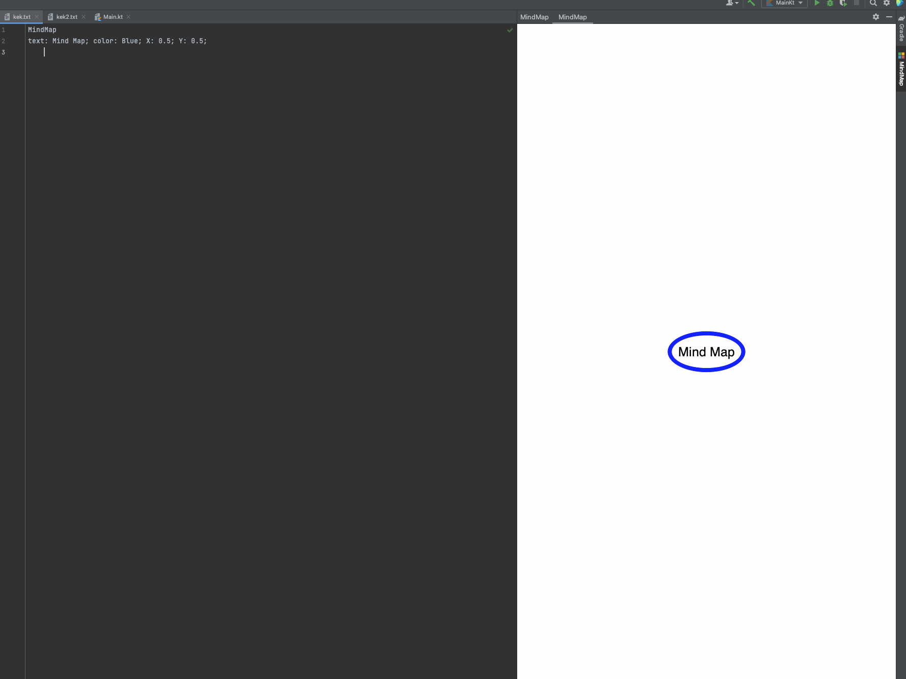

# MindMap

<!-- Plugin description -->
Plugin to test plugin with compose UI. 

This specific section is a source for the [plugin.xml](/src/main/resources/META-INF/plugin.xml) file which will be extracted by the [Gradle](/build.gradle.kts) during the build process.

[comment]: <> (To keep everything working, do not remove `<!-- ... -->` sections. )
<!-- Plugin description end -->

Plugin based on the [IntelliJ Platform Plugin Template][template].

[template]: https://github.com/JetBrains/intellij-platform-plugin-template

--- 

### Пример работы

